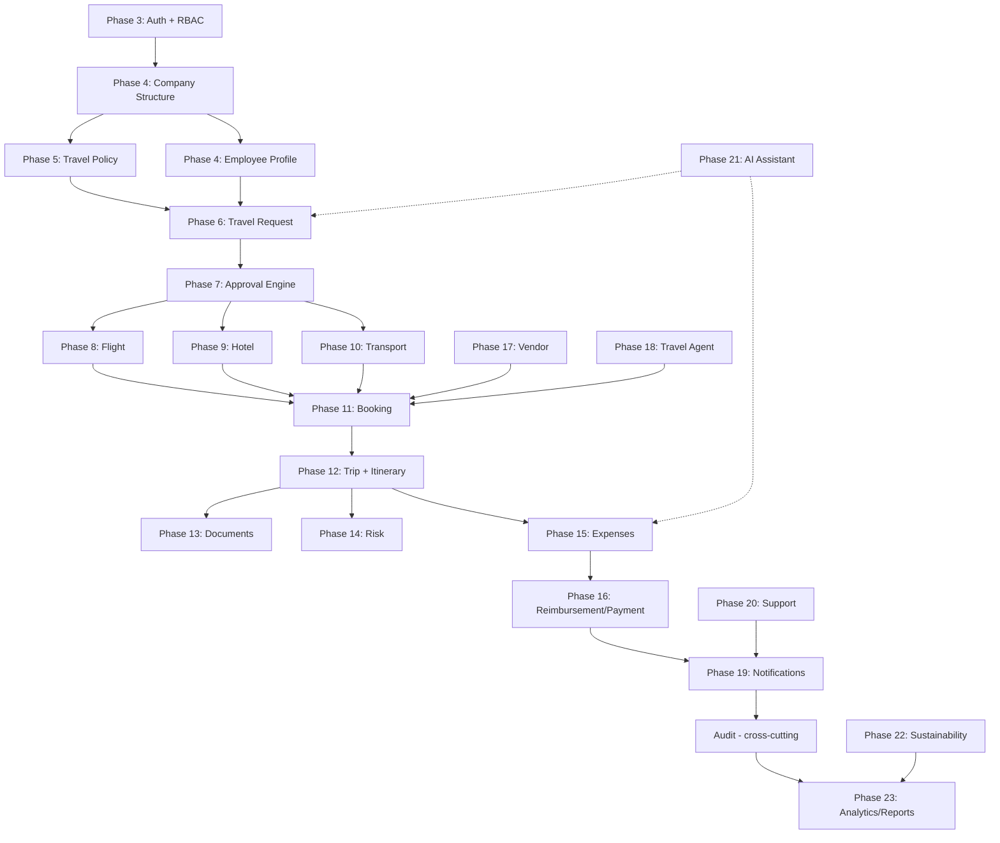

# MODULE-FLOW.md — CBTMS Business Workflow Dependencies

## Master Workflow (Target State)

```
SUPER ADMIN
  → Company → Department → Cost Center → Budget
  → Travel Policy → Users/Roles
  → Employee Registration → OTP → Login
  → Travel Request (DRAFT)
  → Policy Evaluation → Submit
  → Approval Engine (Manager → Travel Admin → Finance)
  → Booking Authorization
  → Flight / Hotel / Transport Search & Book
  → Trip → Itinerary → Documents → Risk
  → Travel (IN_PROGRESS)
  → Expense → Receipt → Approval
  → Reimbursement → Payment → Refund
  → Notification → Audit → Analytics → Reports
  → Trip COMPLETED
```

---

## Module Dependency Graph



---

## Current Implementation vs Target

| Stage | Backend | Frontend | DB | Connected |
|-------|---------|----------|-----|-----------|
| Auth + Portals | ✅ | ✅ Shell | ✅ | Partial |
| Company CRUD | Entity only | ❌ | ✅ org table | ❌ |
| Employee Profile | Entity + seed | ❌ | ✅ | ❌ |
| Travel Policy | Service | ❌ | ✅ | Partial |
| Travel Request | Service + API | Legacy SPA | ✅ | Partial |
| Approval | Service | Legacy SPA | ✅ | Partial |
| Booking | Service + API | Legacy SPA | ✅ | Partial |
| Trip/Itinerary | Entities | ❌ | ✅ | ❌ Not auto-created |
| Expense | Service + API | Legacy SPA | ✅ | Partial |
| Reimbursement | ❌ | ❌ | ❌ | ❌ |
| Payment/Refund | Partial entity | ❌ | Partial | ❌ |
| Notifications | Service | ❌ | ✅ | Partial |
| Audit | Service | ❌ | ✅ | Partial |
| Analytics | Mock aggregates | ❌ | Partial | ❌ |

---

## Cross-Cutting Concerns (Every Module)

1. **CompanyContext** — filter all queries by `organization_id`
2. **Permission check** — `@PreAuthorize` or service-level
3. **AuditLog** — on every state change
4. **Notification** — on business events
5. **Optimistic locking** — on concurrent updates

---

## API Flow Example: Travel Request → Booking

```
POST /api/travel-requests          → TravelRequestService.create (DRAFT)
POST /api/travel-requests/{id}/evaluate → PolicyEvaluationService
POST /api/travel-requests/{id}/submit   → StateMachine → SUBMITTED
GET  /api/approvals/pending             → ApprovalWorkflowService
POST /api/approvals/{id}/approve        → StateMachine → MANAGER_APPROVED
POST /api/flights/search                → FlightProvider.search
POST /api/bookings                      → BookingService → TripService.create
```

Each arrow must persist FK relationships and emit audit + notification events.

---

## Frontend Portal → Module Access

| Portal | Primary Modules |
|--------|----------------|
| Employee | Travel Requests, Bookings, Trips, Expenses, Documents |
| Manager | Approvals, Team Travel, Team Expenses |
| Travel Admin | Policies, Bookings, Vendors, Risk |
| Finance | Expenses, Reimbursements, Payments, Reports |
| Travel Agent | Assigned Requests, Bookings, Modifications |
| Vendor | Bookings, Invoices, Services |
| Super Admin | Companies, Users, System Config, Audit |
